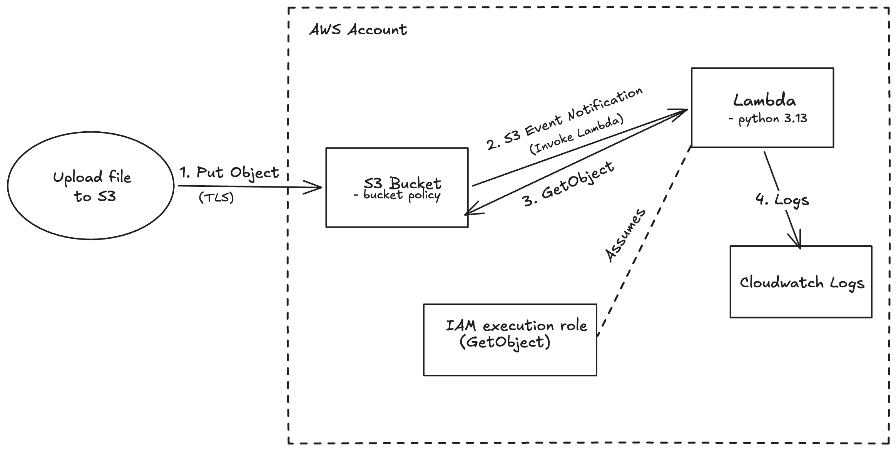

# s3-lambda
S3 Lambda stack for file processing

This project uses AWS CDK (Python) to create infrastructure(s3, lambda, iam) stack in AWS account.
When a file lands in an S3 bucket, a Lambda function is automatically triggered to read and parse its contents. 

The three main resources created are:
- An S3 bucket where files are uploaded 
- A bucket policy that blocks any non-HTTPS requests to the bucket 
- A Python Lambda function that reads the uploaded file and parses its single line of content 


## Architecture 

Add github link for png file



The excalidraw file:  


### How it works 
1. Once file is uploaded to the S3 bucket over TLS. Any request not using TLS is rejected by the bucket policy. 
2. S3 detects the new file and automatically triggers the Lambda function. 
3. The Lambda downloads the file using its IAM role (which only has read access to this bucket), parses the line, and writes the result to CloudWatch Logs. 

#### Prerequisites
Before deploying, make sure you have the following installed and configured:

- Python 3.13
- Node.js 20 or higher
- AWS CDK (`npm install -g aws-cdk`)
- AWS credentials set up locally (`aws configure`) 

##### How to Deploy

1. Clone the repo and set up a virtual environment:

```shell
git clone https://github.com/parag007/s3-lambda.git
cd s3-lambda

python3.13 -m venv .venv
source .venv/bin/activate
pip install -r requirements.txt
```

2. If this is the first time you are using CDK in the AWS account and region, run bootstrap first:

```shell
cdk bootstrap
```

Then deploy:

```shell
cdk deploy
```

3. After a successful deploy, CDK will print the bucket name and Lambda function name as outputs.

-----------------------------------------------------------------------------------------------------
# Testing It

Once deployed, upload a test file to the bucket and check the Lambda logs in cloudwatch.


## Making Changes

To see what will change before applying:
```shell
cdk diff
```

To apply changes:
```shell
cdk deploy
```

To tear down the stack:
```shell
cdk destroy
```

### Deployment Workflow

A sample GitHub Actions workflow is included at `.github/workflows/deploy.yml` to show how this stack would be deployed in a team setting. It is not actively connected to an AWS account for this submission — it is included as a reference.

In a real setup it will use GitHub OIDC to authenticate with AWS instead of storing static access keys in GitHub secrets, which is the recommended approach for CI/CD pipelines.